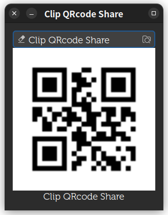
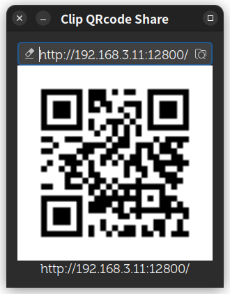
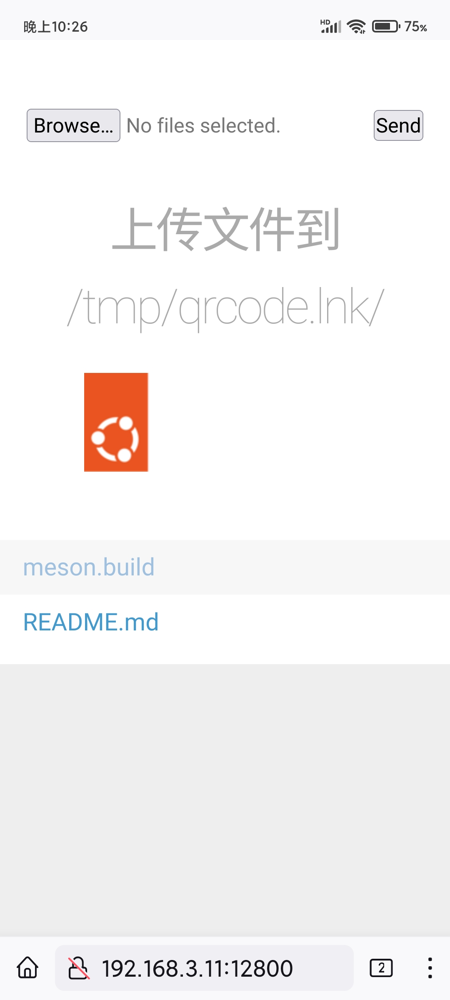

# clip-qrcode-share

## Sharing clipboard and files to mobile by scan QRCode.

- Selected text or copied files/dirctories from nautilus.
- Click the picture to create QRcode.
- Scan the QRcode using mobile.
- Copy/Paste or Browse/Download in mobile.
- Upload file throught web page. (new in version 0.2)
- Distrubution Logo on web.
- No function of sharing the mobile clipboard to the computer.

> `qrencode` must be installed.
> `droopy` must be installed. (new in version 0.2)
> excute `clip-qrcode-share`.

> mobile screenshot

